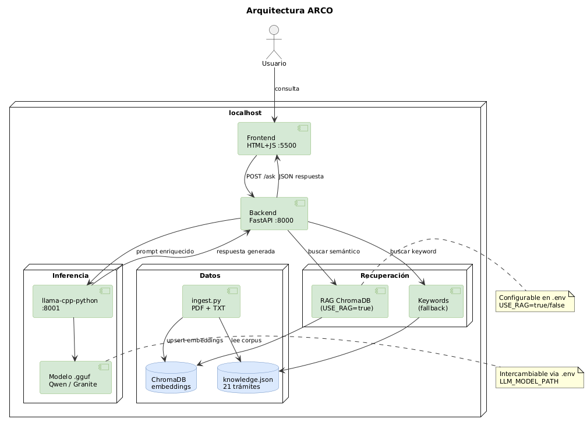

# ARCO — Asistente para el Registro Civil y su Orientación

**Rama activa:** `entrega-3` (`feature/mlops-pipeline` + `feature-dashboard`)  
**Sprint:** 2  
**Última actualización:** Junio 2026

---

## ¿Qué es ARCO?

ARCO es un asistente conversacional que responde preguntas en lenguaje natural sobre trámites del Servicio de Registro Civil e Identificación de Chile. Su propósito es social: reducir fricción, evitar desplazamientos innecesarios y orientar a ciudadanos sobre requisitos, costos, canales y tiempos de entrega de cada trámite.

**ARCO no ejecuta trámites ni captura datos personales. Es un sistema de orientación.**

---

## Novedades Sprint 2

### 1. Un único modelo LLM en producción
`main.py` sirve **un solo modelo** (configurable vía `LLM_URL` / `LLM_MODEL_ID` / `LLM_LABEL` en `.env`, por defecto Granite-4.0-1B). `index.html` ya no tiene selector de modelo ni dispara una segunda consulta silenciosa: cada pregunta llama una sola vez a `/ask`. Comparar varios modelos entre sí es responsabilidad exclusiva de `dashboard.py`.

### 2. Dashboard de benchmark independiente (`dashboard.py` + `dashboard.html`)
El benchmark comparativo entre modelos vive en un servicio separado de `main.py`: **`dashboard.py`** (puerto 8090). Busca archivos `.gguf` en el sistema (`../modelos/` por defecto, más rutas adicionales configurables desde la propia UI), levanta y detiene servidores `llama_cpp.server` para cualquier modelo seleccionado (no solo Granite/Qwen) y envía la misma consulta a N modelos en paralelo. Cada consulta se registra en `dashboard_metrics.jsonl` con latencia total, **time-to-first-token (TTFT)**, **tokens/segundo** y tokens de entrada/salida. El feedback (👍/🤔/👎) se guarda en `dashboard_feedback.jsonl`. El frontend `dashboard.html` es independiente de `index.html` y solo conversa con `dashboard.py`. Ver [Dashboard de benchmark](#dashboard-de-benchmark-dashboardpy) más abajo.

### 3. RAG con ChromaDB e ingestión dinámica
Pipeline de Retrieval-Augmented Generation usando ChromaDB y embeddings `paraphrase-multilingual-MiniLM-L12-v2`. El script `ingest.py` procesa `knowledge.json` y documentos adicionales (PDF, TXT) desde la carpeta `docs/` con deduplicación por hash MD5.

### 4. Versionado de prompts
El system prompt se gestiona en `prompts.json` con soporte multi-versión. La versión activa se controla via `PROMPT_VERSION` en `.env` sin tocar el código. Versiones disponibles: v1.0.0 (base) y v1.1.0 (con clarificación de nacionalidad).

### 5. Pipeline MLOps con tests automáticos
16 tests pytest organizados en tres módulos — conocimiento, prompts y smoke tests — que validan el sistema sin necesitar el LLM corriendo. El pipeline CI/CD corre automáticamente en cada push.

### 6. Evaluación automática con ground truth
10 casos de prueba con trámite esperado y keywords de respuesta. El evaluador genera reportes con timestamp y mantiene un historial. Accuracy actual: 80% (baseline documentado).

### 7. Detección de regresión
Comparación automática contra un baseline aprobado. Si un caso que antes funcionaba deja de funcionar, el pipeline falla y bloquea el merge.

### 8. Observabilidad con logging estructurado
Logging en `arco.log` con formato `timestamp INFO query=... modelo=... tramite=... rag=... followup=...`. Librerías externas (HuggingFace, ChromaDB, httpx) filtradas para mantener el log limpio.

---

## Stack tecnológico

| Capa | Tecnología |
|---|---|
| Backend | Python 3.11 + FastAPI + Uvicorn |
| Frontend | HTML5 + CSS3 + JavaScript vanilla |
| LLM (main.py, producción) | llama-cpp-python server, 1 modelo — Granite-4.0-1B Q4_K_M por defecto |
| LLM (dashboard.py, benchmark) | llama-cpp-python server, N modelos `.gguf` a elección |
| RAG | ChromaDB + sentence-transformers |
| Embeddings | paraphrase-multilingual-MiniLM-L12-v2 |
| Recuperación fallback | Keywords normalizados sobre knowledge.json |
| CI/CD | GitHub Actions |
| Testing | pytest + httpx + FastAPI TestClient |
| Observabilidad | logging estructurado en arco.log |

---

## Arquitectura



---

## Requisitos previos

- Python 3.11+
- Git
- 16 GB RAM recomendados
- 10 GB de espacio libre en disco
- Modelos `.gguf` descargados localmente
- Windows 10+ / Linux / macOS

---

## Instalación

### 1. Clonar los repositorios

```bash
git clone https://github.com/dialtamiranoh/usach-tavi-ARCO-backend.git
git clone https://github.com/dialtamiranoh/usach-tavi-ARCO-frontend.git
```

### 2. Crear y activar el entorno virtual

```bash
# Windows
python -m venv .venv
.venv\Scripts\Activate.ps1

# Linux / macOS
python -m venv .venv
source .venv/bin/activate
```

### 3. Instalar dependencias

```bash
cd usach-tavi-ARCO-backend
pip install -r requirements.txt
pip install "llama-cpp-python[server]"
```

### 4. Configurar variables de entorno

```bash
cp .env.example .env
```

Editar `.env` con la ruta real al modelo que usará `main.py`:

```env
LLM_URL=http://127.0.0.1:8001/v1/chat/completions
LLM_MODEL_ID=granite-4.0-1b-instruct
LLM_LABEL=Granite-4.0-1B
LLM_TEMPERATURE=0.1
LLM_MAX_TOKENS=140
USE_RAG=false
PROMPT_VERSION=1.1.0
```

### 5. Ingestar el corpus (solo si USE_RAG=true)

```bash
python ingest.py
```

---

## Ejecución

Abrir tres terminales con el venv activo:

### Terminal 1 — Modelo LLM (el que apunte `LLM_URL` en `.env`)

```bash
python -m llama_cpp.server \
  --model "RUTA/granite-4.0-1b-a800m-instruct-q4_k_m.gguf" \
  --host 127.0.0.1 --port 8001 \
  --model_alias granite-4.0-1b-instruct --n_ctx 2048
```

Verificar: `http://127.0.0.1:8001/v1/models`

### Terminal 2 — Backend

```bash
cd usach-tavi-ARCO-backend
uvicorn main:app --port 8000 --reload
```

Verificar: `http://127.0.0.1:8000`

### Terminal 3 — Frontend

```bash
cd usach-tavi-ARCO-frontend
python -m http.server 5500
```

Abrir en el navegador:
- Chat: `http://127.0.0.1:5500/index.html`

### Terminal 4 — Dashboard de benchmark (opcional)

```bash
cd usach-tavi-ARCO-backend
uvicorn dashboard:app --port 8090 --reload
```

Abrir `http://127.0.0.1:5500/dashboard.html`. A diferencia del modelo de la Terminal 1, **este dashboard levanta sus propios modelos**: no necesitas tenerlos corriendo de antemano. Ver [Dashboard de benchmark](#dashboard-de-benchmark-dashboardpy).

---

## Uso del sistema

### Consultas de ejemplo

| Consulta | Respuesta esperada |
|---|---|
| "quiero sacar mi pasaporte" | Canal mixto, costo, plazo 8 días hábiles, fuente oficial |
| "¿cuánto cuesta el certificado de antecedentes?" | Gratis en línea / $1.050 en oficina |
| "soy extranjero y necesito sacar mi cédula" | Reserva de hora, presencial, 20 días hábiles |
| "necesito un papel para viajar fuera de Chile" | Pasaporte (con RAG activado) |
| "quiero renovar mi licencia de conducir" | Fallback: fuera del dominio de ARCO |

### Cambiar el modelo de producción

Editar `LLM_URL`, `LLM_MODEL_ID` y `LLM_LABEL` en `.env` y reiniciar `main.py`. Para comparar modelos entre sí sin tocar producción, usar `dashboard.py`.

### Cambiar versión del prompt

Editar `.env`:
```env
PROMPT_VERSION=1.0.0   # Prompt base
PROMPT_VERSION=1.1.0   # Con clarificación de nacionalidad

# Opcional si se ejecuta un modelo local por ruta directa
LLM_MODEL_PATH=C:/Users/TU_USUARIO/models/granite-4.0-1b-a800m-instruct-q4_k_m.gguf
```

Reiniciar el backend para aplicar el cambio.

### Agregar documentos al corpus RAG

```bash
# Copiar documentos a docs/
cp manual_registro_civil.pdf docs/

# Reingestar
python ingest.py

# Reiniciar el backend
uvicorn main:app --port 8000 --reload
```

---

## API — main.py (producción, puerto 8000)

| Método | Ruta | Descripción |
|---|---|---|
| GET | `/` | Estado del backend y del modelo activo |
| GET | `/models` | Info del modelo configurado (url, model_id, label) |
| POST | `/ask` | Consulta al modelo |

El benchmark, las métricas y el feedback quedaron fuera de `main.py`; viven en `dashboard.py` (ver más abajo).

### Ejemplo POST /ask

```json
{
  "query": "quiero sacar mi pasaporte",
  "history": [],
  "context": null
}
```

```json
{
  "tramite": "Pasaporte",
  "respuesta": "Para obtener o renovar tu pasaporte...",
  "costo": "$69.660 (32 paginas) / $69.740 (64 paginas)",
  "duracion": "8 dias habiles desde la solicitud",
  "canal": "mixto",
  "presencialidad": "si",
  "requiere_clave_unica": "si",
  "fuente": "https://www.chileatiende.gob.cl/fichas/3445-pasaporte",
  "trace_id": "uuid",
  "model_used": "Granite-4.0-1B",
  "latency_ms": 1200,
  "total_tokens": 320,
  "fallback": false
}
```

---

## Tests y evaluación

### Correr tests automáticos

```bash
pytest tests/ -v
```

16 tests en 3 módulos:
- `tests/test_knowledge.py` — 6 tests (estructura del corpus)
- `tests/test_prompts.py` — 3 tests (instrucciones del system prompt)
- `tests/test_smoke.py` — 7 tests (endpoints sin LLM)

### Correr evaluador con ground truth

```bash
python eval/evaluador.py
```

Genera `eval/reporte_YYYYMMDD_HHMMSS.json` y actualiza `eval/reporte_latest.json`.

### Verificar regresiones vs baseline

```bash
python eval/verificar_baseline.py
```

Falla con exit code 1 si algún caso que antes pasaba ahora falla.

### Estado actual del evaluador

| Caso | Query | Estado |
|---|---|---|
| TC-01 | quiero sacar pasaporte | ✅ PASS |
| TC-02 | cuanto cuesta el certificado de antecedentes | ✅ PASS |
| TC-03 | renovar carnet de identidad | ✅ PASS |
| TC-04 | cedula para extranjeros | ❌ FAIL (limitación keyword search) |
| TC-05 | sacar clave unica | ✅ PASS |
| TC-06 | transferir un vehiculo | ✅ PASS |
| TC-07 | inscribir nacimiento recien nacido | ❌ FAIL (limitación keyword search) |
| TC-08 | sacar certificado de nacimiento | ✅ PASS |
| TC-09 | casarse en el registro civil | ✅ PASS |
| TC-10 | quiero renovar licencia de conducir | ✅ PASS |

TC-04 y TC-07 fallan porque el keyword search por substring no resuelve ambigüedad semántica. Se resuelven activando RAG (`USE_RAG=true`).

---

## Estructura del repositorio

```
usach-tavi-ARCO-backend/
├── main.py                  # Backend FastAPI de producción — 1 modelo LLM, RAG, WhatsApp
├── dashboard.py              # Backend FastAPI de benchmark — descubre/levanta modelos .gguf, TTFT, métricas
├── ingest.py                # Ingestión dinámica PDF/TXT con hash MD5
├── knowledge.json           # Corpus 21 trámites Registro Civil
├── prompts.json             # Versionado de prompts (v1.0.0 y v1.1.0)
├── requirements.txt
├── .env.example             # Plantilla de variables de entorno
├── .gitignore
├── Arquitectura.png
├── README.md
├── tests/
│   ├── conftest.py          # Fuerza USE_RAG=false para todos los tests
│   ├── test_knowledge.py    # 6 tests validación corpus
│   ├── test_prompts.py      # 3 tests validación prompt
│   └── test_smoke.py        # 7 tests endpoint sin LLM
├── eval/
│   ├── casos_prueba.json    # 10 casos ground truth
│   ├── evaluador.py         # Evaluador automático con historial timestamp
│   ├── verificar_baseline.py # Detección de regresión vs baseline
│   ├── baseline.json        # Snapshot aprobado (no se modifica manualmente)
│   └── reporte_latest.json  # Último reporte generado
├── docs/                    # Documentos adicionales para RAG (no sube a git)
├── chroma_db/               # Base de datos vectorial ChromaDB (no sube a git)
├── logs/                    # Logs por modelo lanzado desde dashboard.py (no sube a git)
└── .github/
    └── workflows/
        └── ci.yml           # Pipeline CI/CD GitHub Actions
```

---

## CI/CD Pipeline

El pipeline corre automáticamente en cada push a `main` y `feature/*`:

```
git push
    ↓
GitHub Actions
    ↓
  1. Instalar Python 3.11 + dependencias
  2. Validar knowledge.json (JSON válido + campos obligatorios)
  3. Validar sintaxis main.py
  4. pytest tests/ -v --tb=short (16 tests)
  5. python eval/evaluador.py (accuracy >= 90% requerida)
  6. python eval/verificar_baseline.py (sin regresiones)
```

---

## Archivos de datos (no suben a git)

| Archivo | Contenido |
|---|---|
| `dashboard_metrics.jsonl` | Una línea por (consulta, modelo) desde `dashboard.py`: latencia, TTFT, tokens/seg, tokens, trámite |
| `dashboard_feedback.jsonl` | Feedback (👍/🤔/👎) por (`trace_id`, `alias`) desde `dashboard.py` |
| `arco.log` | Log estructurado de consultas de `main.py` |
| `logs/<alias>.log` | Salida de cada servidor `llama_cpp.server` lanzado por `dashboard.py` |
| `chroma_db/` | Base vectorial ChromaDB |
| `docs/` | Documentos adicionales para RAG |

---

## Mejoras pendientes

### Alta prioridad
- [ ] Resolver TC-04 y TC-07 con RAG semántico activado
- [ ] Lógica de detección de ambigüedad en `main.py` con campo `ambiguo` en `knowledge.json`
- [ ] Benchmark comparativo Qwen2.5-1.5B vs Granite-4.0-1B (tiempo de respuesta y calidad)
- [ ] Merge de `feature/dynamic-llm` a `main` con pruebas de regresión
- [ ] Merge de `feature/mlops-pipeline` a `main`
- [ ] Benchmark formal Granite vs Qwen con 20+ consultas documentadas

### Media prioridad
- [ ] Integración WhatsApp via Twilio + n8n
- [ ] Despliegue en Railway con GPT-4o mini como LLM
- [ ] Soporte `.docx` en el ingestor

### Baja prioridad
- [ ] Historial persistente de conversaciones (SQLite)
- [ ] Scraping automático de ChileAtiende para actualización del corpus

---

## Equipo

| Integrante | Rol |
|---|---|
| Diego Altamirano Hernández | Product Owner / Analista |
| Roberto Orellana Tamayo | Backend Developer |
| Pablo Purches Zapata | IA / Datos |
| Gianello Valenzuela Robin | Frontend / QA |

**Profesor:** Daniel Gacitúa Vásquez  
**Curso:** TAVI 2026-1 — Ingeniería de Ejecución en Computación e Informática, USACH

---

## Dashboard de benchmark (`dashboard.py`)

`dashboard.py` es un servicio FastAPI **independiente de `main.py`**, pensado para comparar cualquier cantidad de modelos `.gguf` sin editar `.env` ni reiniciar nada a mano.

```
dashboard.py (:8090)
  ├── GET  /gguf/scan          busca .gguf en ../modelos/ + carpetas extra
  ├── GET  /system/info        hilos de CPU detectados y modelos activos
  ├── POST /models/launch      levanta un lote de .gguf a la vez (puerto y n_threads automáticos)
  ├── POST /models/stop        detiene un servidor
  ├── GET  /models/status      estado de cada modelo levantado (starting / ready / error)
  ├── POST /ask                envía la misma consulta a N modelos ready, en paralelo, midiendo TTFT
  ├── POST /feedback           feedback (trace_id, alias, score)
  ├── GET  /metrics            historial completo con feedback
  ├── GET  /stats/compare      agregados por modelo (latencia, TTFT, tokens/seg, feedback)
  └── GET  /metrics/timeline   series de tiempo por modelo (últimas 50 consultas)
```

`dashboard.html` consume exclusivamente esta API (no `main.py`) y permite: buscar `.gguf` en el sistema, seleccionarlos y levantarlos con un clic, elegir cuáles usar en una consulta y comparar respuestas y métricas lado a lado.

### Comparación en paralelo, sin que los modelos se pisen la CPU

`POST /ask` ya despachaba las N consultas simultáneamente (`ThreadPoolExecutor`), pero eso no bastaba para una comparación limpia: cada `llama_cpp.server` reserva por defecto la mitad de los cores para generar texto y **todos** los cores para procesar el prompt — si corres 2 modelos a la vez, ambos compiten justo en la ventana que mide el TTFT.

Por eso `POST /models/launch` recibe una **lista** de `.gguf` (`{"paths": [...]}`) y reparte `os.cpu_count()` entre todos los modelos que van a quedar activos, pasando `--n_threads`/`--n_threads_batch` explícitos a cada `llama_cpp.server`. `GET /system/info` expone cuántos hilos detectó la máquina, y `GET /models/status` incluye `n_threads` por modelo. En una prueba real con 2 modelos (8 hilos → 4 c/u), el tiempo total de un `/ask` con ambos coincidió con la latencia individual de cada uno (no con la suma), confirmando que corren en paralelo de verdad.

Limitación conocida: el reparto se calcula al momento de lanzar; si agregas un modelo nuevo mientras otros ya están `ready`, esos no se reinician para achicar su cuota. Para una comparación perfectamente pareja, selecciona todos los modelos a comparar y presiona "Levantar seleccionados" una sola vez.

### Ejecutarlo

```bash
cd usach-tavi-ARCO-backend
uvicorn dashboard:app --port 8090 --reload
```

```bash
cd usach-tavi-ARCO-frontend
python -m http.server 5500
# abrir http://127.0.0.1:5500/dashboard.html
```

No hace falta tener ningún `llama_cpp.server` corriendo de antemano: se levantan desde la pestaña **Modelos** del dashboard al seleccionar un `.gguf`.

### Métricas por consulta

| Métrica | Qué mide |
|---|---|
| `latency_ms` | Tiempo total desde el envío hasta la última respuesta del modelo |
| `ttft_ms` | **Time-to-first-token** — tiempo hasta que llega el primer fragmento generado (streaming) |
| `tokens_per_sec` | Tokens de salida ÷ tiempo de generación tras el primer token — throughput real del modelo |
| `input_tokens` / `output_tokens` / `total_tokens` | Estimados por caracteres (`llama_cpp.server` no reporta `usage` en modo streaming) |
| `error` | Mensaje de error si la llamada al modelo falló; `dashboard.py` no fabrica una respuesta de respaldo — si falla, se registra el error y no hay `respuesta` |

### Variables de entorno relevantes

```env
# Carpetas donde dashboard.py busca .gguf, separadas por ";" (además de ../modelos/ por defecto)
DASHBOARD_MODEL_DIRS=

# Host/puerto base para los llama_cpp.server que dashboard.py lanza
DASHBOARD_LLAMA_HOST=127.0.0.1
DASHBOARD_LLAMA_PORT_START=8600

# Contexto por defecto y timeout de arranque (segundos) para cada modelo levantado
DASHBOARD_N_CTX=2048
DASHBOARD_HEALTH_TIMEOUT=180

# Fuerza un n_threads fijo por modelo en vez del reparto automático
# (CPU_THREADS ÷ modelos activos). Déjala vacía salvo que sepas lo que haces.
DASHBOARD_N_THREADS=
```

`LLM_TEMPERATURE`, `LLM_MAX_TOKENS` y `PROMPT_VERSION` son compartidos con `main.py` (mismo `.env`, mismo `prompts.json`).
